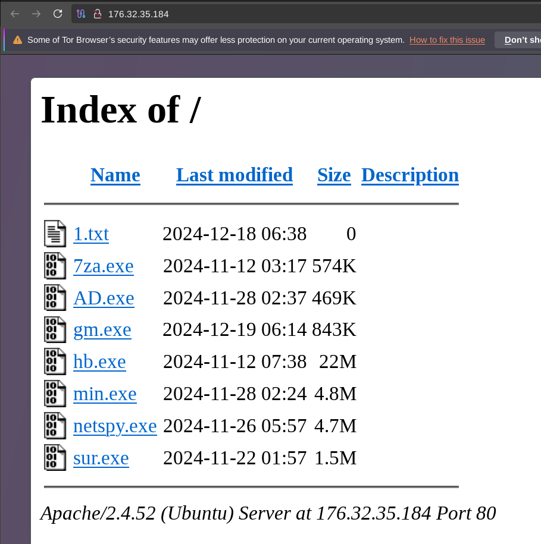

I found an `open-dir` containing various executables, one of them is this: `github.com/shmilylty/netspy`. I wasn't able to find any info on `sur.exe` so I took a look into it.

```
sur.exe 

SHA256: 1400622ed265b9bc0e52056c9b59762b203154a597b5b98c91a503950a1085e2

Virustotal: https://www.virustotal.com/gui/file/1400622ed265b9bc0e52056c9b59762b203154a597b5b98c91a503950a1085e2

ANY.RUN: https://any.run/report/1400622ed265b9bc0e52056c9b59762b203154a597b5b98c91a503950a1085e2/eb482834-92ba-4c69-9955-3ed779fb5350
```

A simple stealer for collecting browser data (credentials, bookmarks, history etc.). Has console output and stores the results in a directory `result` created in the path the executable is run from. 

The paths to browser data are all encrypted using XOR encryption. The encryption works as follows:

- the encrypted string is stored in the `.data` section
- for each encrypted string there is a struct in the data section which contains an address and a size. The address is always set to zero and written during runtime. The size is the string length. 
- upon runtime, in an exception handler, the encrypted string from the `.data` section is copied to heap allocated memory
- the address of the heap allocation is written into the struct
- the struct is used by the decryption routine to decrypt the string

For example, the struct for one string is located at `0x0057ccd0`, the encrypted buffer at `0x00566f50` with a length of `0x14`.

Some decoded strings:

```
[*] decoded:
C:\Users\%s\Appdata\
[*] struct @ 0x0057ccd0 enc @ 0x00566f50
[*] decoded:
Local\Microsoft\Edge\User Data
[*] struct @ 0x0057cca0 enc @ 0x00566fb8
[*] decoded:
Local\Google\Chrome\User Data
[*] struct @ 0x0057cd18 enc @ 0x00566f68
[*] decoded:
Local\Chromium\User Data
[*] struct @ 0x0057cc88 enc @ 0x00566f90
[*] decoded:
Local\Yandex\YandexBrowser\User 
[*] struct @ 0x0057cd78 enc @ 0x00566fe0
[*] decoded:
Roaming\Mozilla\Firefox
[*] struct @ 0x0057cd48 enc @ 0x00567010

-- RESULT -----------------------------------

0x0057ccd0 => C:\Users\%s\Appdata\
0x0057cca0 => Local\Microsoft\Edge\User Data
0x0057cd18 => Local\Google\Chrome\User Data
0x0057cc88 => Local\Chromium\User Data
0x0057cd78 => Local\Yandex\YandexBrowser\User 
0x0057cd48 => Roaming\Mozilla\Firefox
---------------------------------------------
```

observed no exfiltration by the malware.